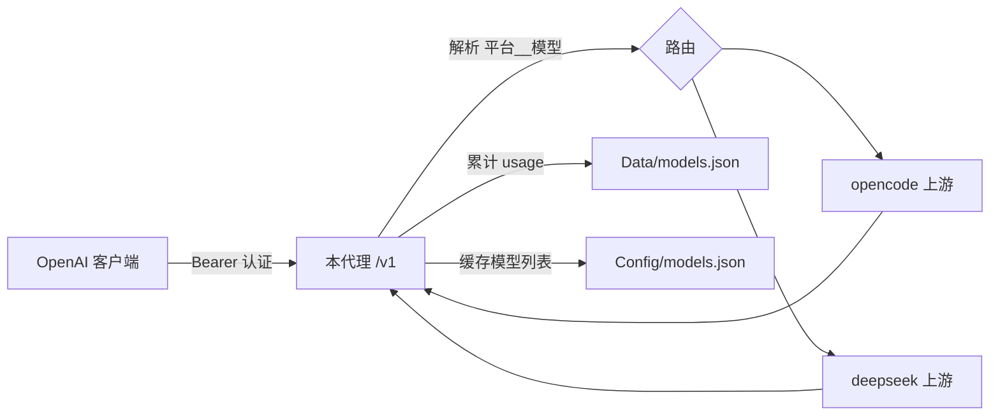

# SimpleAISite（多平台 AI 代理）

一个基于 Node.js + Express 的轻量级 AI 接口聚合代理服务。它把多个上游 AI 平台（如 OpenCode、DeepSeek 等）统一封装成 **OpenAI 兼容格式** 的接口，并提供简单的用量统计与平台管理 API。

## 功能特性

- **多平台聚合**：通过统一的内部模型名路由到不同上游平台，对外暴露标准 OpenAI `/v1` 接口。
- **OpenAI 兼容**：支持 `/v1/models` 列表查询以及 `/v1/*` 的聊天/补全代理（含流式 SSE）。
- **Bearer 认证**：通过 `accessKey` 保护所有接口。
- **模型列表缓存**：启动时及按间隔自动刷新各平台模型列表，缓存至 `Config/models.json`。
- **Token 用量统计**：自动累计每个内部模型的 Token 消耗，持久化到 `Data/models.json`。
- **运行时管理 API**：可查看平台状态、用量、模型，并支持热更新平台配置（无需重启）。

## 目录结构

```
SimpleAISite/
├── Config/
│   ├── config.json       # 运行时配置（端口、密钥、平台列表）
│   └── models.json       # 自动缓存的各平台模型列表
├── Data/
│   └── models.json       # 自动持久化的 Token 用量统计
├── index.js              # 服务主程序（Express 应用）
├── package.json          # 依赖与启动脚本
└── index.html            # 前端站点页面

```

> `Config/models.json` 与 `Data/models.json` 会在首次运行时自动生成，无需手动创建。

## 环境要求

- Node.js 18+（使用 ESM 模块与顶层 `await`）
- npm

## 安装与运行

```bash
# 安装依赖
npm install

# 启动服务（默认读取/生成 Config/config.json）
npm start
```

启动后控制台会输出监听地址与认证状态，例如：

```
多平台 AI 代理已启动: http://localhost:3000/v1
认证密钥: 已启用
```

## 配置说明

配置文件位于 `Config/config.json`，首次运行会自动创建默认值：

```json
{
  "port": 3000,
  "accessKey": "sk-your-keys",
  "platforms": {
    "opencode": {
      "url": "https://opencode.ai/zen/v1",
      "key": "sk-opencode-xxxxxxxx",
      "defaultHeaders": {}
    },
    "deepseek": {
      "url": "https://api.deepseek.com/v1",
      "key": "sk-deepseek-xxxxxxxx",
      "defaultHeaders": {}
    }
  },
  "modelsRefreshInterval": 3600000
}
```

| 字段 | 说明 |
| --- | --- |
| `port` | 服务监听端口 |
| `accessKey` | 客户端调用接口时需在 `Authorization: Bearer <accessKey>` 中携带的密钥；留空则关闭认证 |
| `platforms` | 上游平台字典，键为平台名，值包含 `url`（上游 base URL）、`key`（上游 API Key）、`defaultHeaders`（附加请求头） |
| `modelsRefreshInterval` | 模型列表自动刷新间隔（毫秒），默认 1 小时 |

## 模型命名规则

代理使用内部模型名来路由请求，格式为：

```
平台名__[前缀/]模型标识
```

- `平台名`：对应 `config.json` 中 `platforms` 的键（如 `opencode`、`deepseek`）。
- `__`：双下划线分隔符。
- `[前缀/]模型标识`：上游平台实际的模型 ID。若不含 `/`，代理会自动补上 `/` 前缀。

示例：

- `opencode__/gpt-4o` → 路由到 `opencode` 平台，上游模型为 `gpt-4o`
- `deepseek__/deepseek-chat` → 路由到 `deepseek` 平台，上游模型为 `deepseek-chat`

`/v1/models` 返回的模型 `id` 即为上述内部模型名，可直接用于 OpenAI 客户端。

## 接口说明

所有接口（除健康检查外）均需携带 `Authorization: Bearer <accessKey>` 请求头。

### OpenAI 兼容接口

| 方法 | 路径 | 说明 |
| --- | --- | --- |
| GET | `/v1/models` | 返回聚合后的模型列表（内部模型名） |
| ANY | `/v1/*` | 代理到对应上游平台的 OpenAI 接口（如 `/v1/chat/completions`），支持流式 |

请求体需包含 `model` 字段，值为内部模型名，例如：

```json
{
  "model": "deepseek__/deepseek-chat",
  "messages": [{ "role": "user", "content": "你好" }],
  "stream": false
}
```

### 管理接口

| 方法 | 路径 | 说明 |
| --- | --- | --- |
| GET | `/ai-api/health` | 健康检查，返回运行状态与运行时长 |
| GET | `/ai-api/platforms` | 各平台状态（不含密钥）与模型数量 |
| GET | `/ai-api/models` | 所有模型及其用量统计 |
| GET | `/ai-api/usage` | Token 用量统计 |
| GET | `/ai-api/config/platforms` | 获取完整平台配置（含密钥） |
| PUT | `/ai-api/config/platforms` | 更新平台配置并立即刷新模型列表 |

更新平台配置示例：

```bash
curl -X PUT http://localhost:3000/ai-api/config/platforms \
  -H "Authorization: Bearer sk-your-keys" \
  -H "Content-Type: application/json" \
  -d '{
    "opencode": { "url": "https://opencode.ai/zen/v1", "key": "sk-new-key", "defaultHeaders": {} }
  }'
```

## 作为 OpenAI 客户端使用

将 `baseURL` 指向本服务的 `/v1`，`apiKey` 使用本服务的 `accessKey`，`model` 使用内部模型名即可：

```javascript
import OpenAI from 'openai';

const client = new OpenAI({
  baseURL: 'http://localhost:3000/v1',
  apiKey: 'sk-your-keys'   // 对应 config.json 的 accessKey
});

const completion = await client.chat.completions.create({
  model: 'deepseek__/deepseek-chat',
  messages: [{ role: 'user', content: '你好' }]
});

console.log(completion.choices[0].message.content);
```

## 数据流示意



## 依赖

- [express](https://www.npmjs.com/package/express) — HTTP 服务框架
- [axios](https://www.npmjs.com/package/axios) — 上游请求与流式转发
